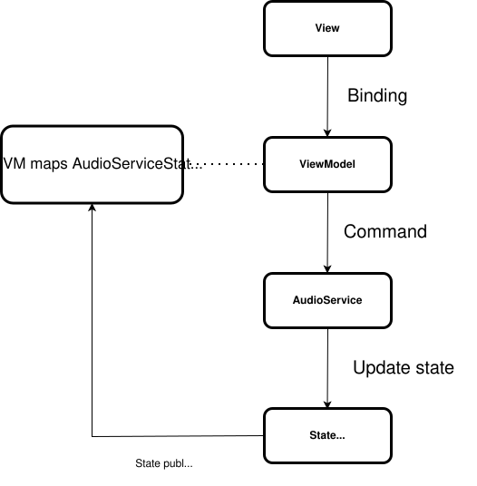
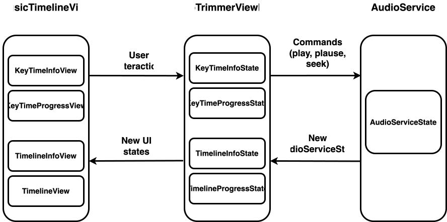

# Audio Trimmer (iOS)

An iOS audio trimmer demo app built with **SwiftUI** and **MVVM**, focusing on
clear state management and unidirectional data flow between UI and service layers.

---

## Features

- Audio timeline with waveform preview
- Key Time selection (supports multiple selection)
- Play / Pause / Seek / Reset playback
- Real-time playback progress updates
- Programmatic and user-driven seeking

---

## Architecture Overview

This app follows a **View → ViewModel → Service** architecture.

- **View (SwiftUI)**  
  Renders UI and forwards user interactions.

- **ViewModel**  
  - Observes `AudioServiceState`
  - Maps service state into UI-friendly states
  - Handles user actions and issues commands to the service

- **AudioService**  
  - Manages playback logic
  - Emits state updates via a publisher

- **State**  
  - `AudioServiceState`: source of truth for playback
  - UI states derived in the ViewModel

---

## High-level Diagram

---

## State Binding Diagram

---

